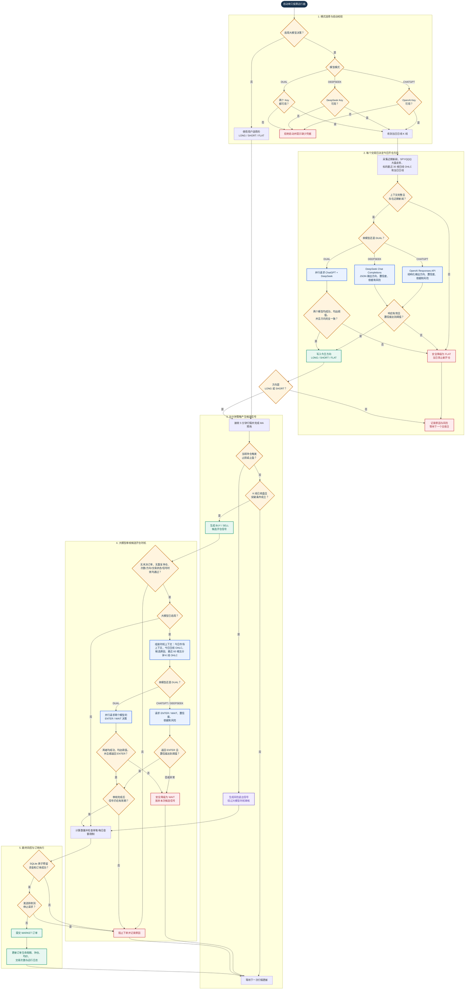

# AutoQuant 大模型开仓决策流程图

本流程图对应当前程序中的 ChatGPT、DeepSeek 和双模型决策逻辑。大模型只参与“今日开仓方向”和“候选开仓时机”两道关口；止损、止盈等风险退出不经过大模型审核。

## 关键安全规则

- 大模型关闭时，系统按手动方向运行，不调用 ChatGPT 或 DeepSeek。
- 大模型开启时，手动方向不作为失败兜底；任何数据缺失、网络异常、格式错误、低置信度或双模型分歧都会转为 `FLAT/WAIT`。
- `DUAL` 模式要求今日方向一致，并要求两个模型都同意 `ENTER`。
- 方向判断固定提供最近 30 根日线，时机判断固定提供最近 60 根五分钟 K 线和今日日线；所有 K 线都包含开盘价、最高价、最低价、收盘价。
- 大模型审核期间若收到停止请求，或审核完成后信号已经过期，系统不会下单。
- 止损和止盈属于风险退出，始终绕过大模型时机审核，避免模型故障阻碍平仓。
- OpenAI/DeepSeek Key 只随启动请求临时传递，或从后端环境变量读取，不写入 `config.json` 和 `running.json`。

PNG 版本：[大模型开仓决策流程图.png](大模型开仓决策流程图.png)
