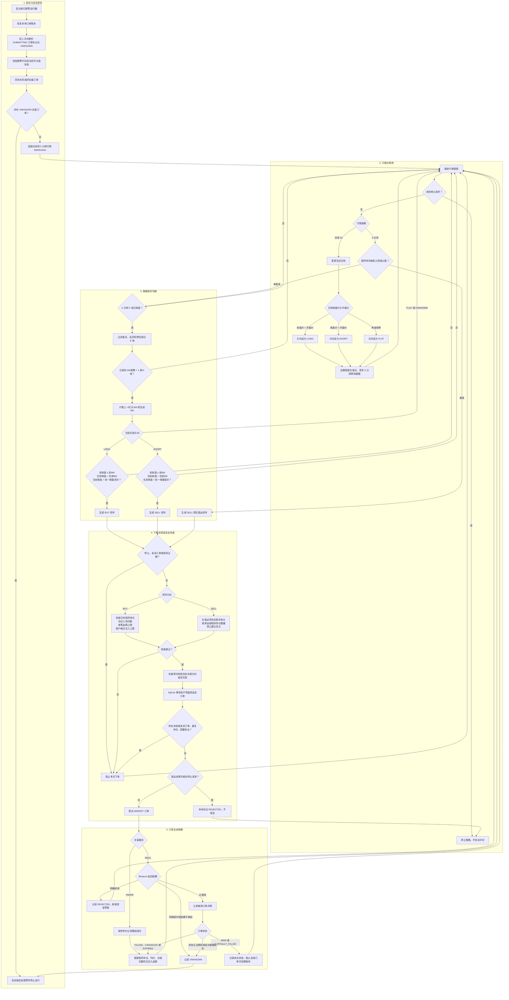

# AutoQuant 量化策略流程图

本流程图对应当前程序的实际执行逻辑，包含行情预热、策略信号、资金风控、订单提交和订单生命周期管理。

## 核心规则

- 正常入场信号只使用已经收盘的 5 分钟 K 线。
- 止损和止盈会随每次 5 分钟行情更新检查，触发后优先覆盖普通策略信号。
- 实盘为只做多模式：`BUY` 建仓，`SELL` 只能平掉程序确认的多头。
- 点击停止只阻止新订单，不会撤销未决订单，也不会自动平仓。
- 任何无法确认状态的实盘订单都会进入安全锁定。
